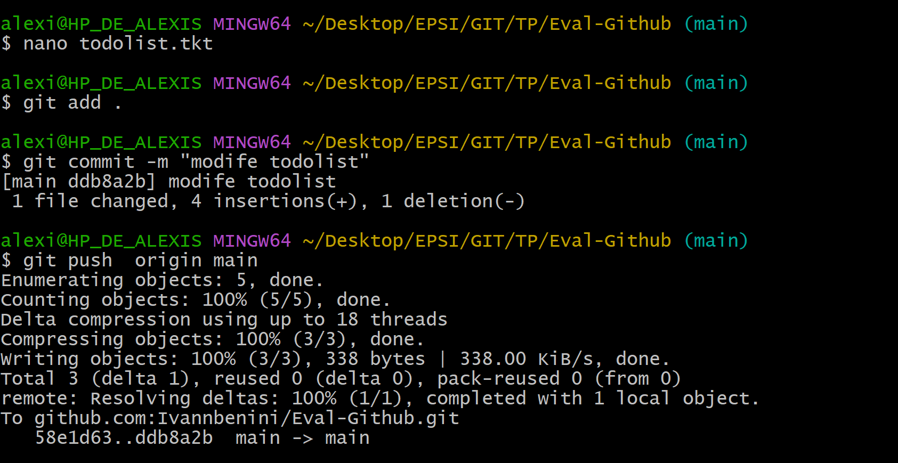

# Eval-Github
Ivann Benini  
Alexis Briet  
23/09/25

## Alexis Elève  A
On fait un git clone du reposetory  

On crée une nouvelle branche dans mon cas Alexis par exemple   

Ensuite On va le push dans notre github pour qu'il apparaisse
j'ai fait un commit de mes modifications 

On créer un fichier presenation qu'on va ensuite mettre dans le git local   

Ensuite j'ai fait un commit de mes modifications  

On revient dans notre main avec un checkout
On duplique nos modif dans ma branche Alexis et un on push notre main local   

Je recupere son todolist   

Je le modifie, je l'ajoute dans le git local, le commit pour annoncer les modifications et enfin je push dans le main   

## Ivann Eleve B 

Création branche Ivann

Création Fichier todolist.txt

Commit et Duplication de Ivann dans Main

Ajout de la Branch Ivann dans Github

Erreur du a la mauvaise version

Resolution du probleme en récupérant la dernière version et fusion de ma branche

Modification du fichier d’Alexis

Versionning et push de la modification

